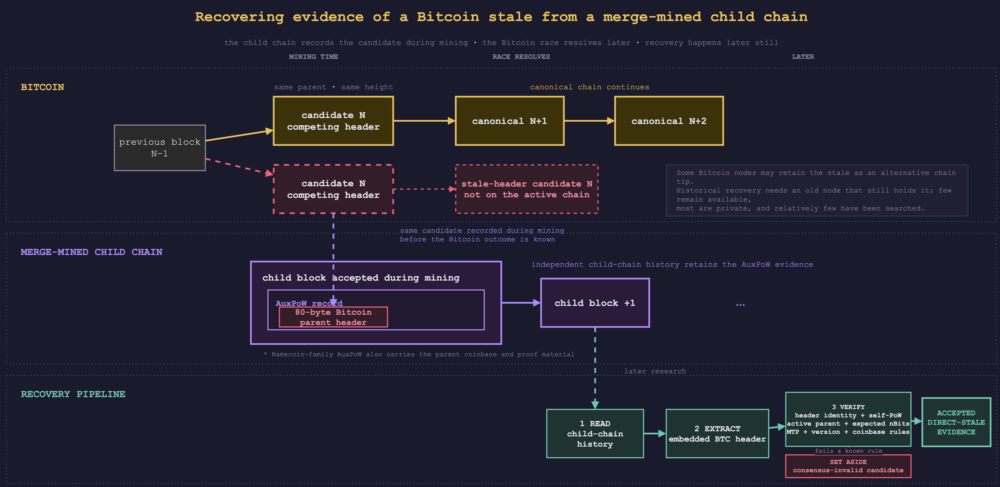

# Merge Mining Research

Research into Bitcoin merge mining and what it reveals about the network.

[Auxiliary proof of work (AuxPoW)](https://deadmanoz.xyz/posts/2026/merge-mining)
is a common merge-mining construction that lets a sibling chain reuse
Bitcoin's hashing work. A Bitcoin miner commits the sibling chain's block in a
Bitcoin coinbase, and the sibling chain accepts the associated Bitcoin header
as proof of work. The sibling ledger can therefore preserve what Bitcoin
parent a miner was building on and when. Namecoin-family proofs also preserve
the parent coinbase and related proof material; other designs, notably RSK,
expose less. Pool identity is a later inference where the available evidence
supports it, not a field recorded directly by every chain.
Almost 30 chains have merge-mined with Bitcoin since Namecoin activated AuxPoW
in 2011, leaving a large, independently hosted corpus of mining evidence.

This repository collects tooling, datasets, and methodology that mine that
corpus for questions about Bitcoin mining generally: mining pools, block
propagation, and the canonical-versus-stale record. Currently, its most
developed work recovers stale Bitcoin blocks from evidence preserved by
merge-mined sibling chains. It also includes a tested registry and decoders for
recognising AuxPoW and chain-specific commitment patterns in Bitcoin coinbase
scripts. A canonical-chain scanner and generated commitment census are not
part of this release. Further directions (mining-proxy and aggregator analysis,
selfish-mining analysis, and mining-pool operations analysis) may follow. See
[`docs/research-directions.md`](docs/research-directions.md).

This repository is the public successor to earlier private work on stale
blocks. Private and bulky artifact boundaries are documented below. The [Merge Mining Monitor](https://mmm.deadmanoz.xyz/) combines live
tracking of merge-mined chains with the historical datasets produced here
([source code](https://github.com/deadmanoz/merge-mining-monitor)).
This repository remains the research and data side: methodology, reproducible
tooling, and published datasets.

## Stale-block recovery

A stale block is a valid Bitcoin block that lost a propagation race and did not
remain in the canonical chain. The AuxPoW evidence recovered here usually
contains a competing Bitcoin header and its coinbase evidence, not the complete
Bitcoin block. The repository therefore publishes **direct-stale header
candidates** and states which necessary validity checks they passed. Unless a
complete block has been independently validated, `classification=stale` and
`validation_status=VALID` do not assert full Bitcoin block validity. See the
[data validity contract](docs/data-validity.md).

Bitcoin nodes that received a stale block may retain it as an alternative chain
tip, but historical recovery requires access to a node that was running when
the block propagated and still holds that data. Few such nodes remain
available, most are private, and relatively few have been searched for stales.
Merge-mined sibling chains provide another source: they can preserve the losing
Bitcoin header in their own block history long after the original event.



*A merge-mined child chain can preserve a competing Bitcoin header before the
Bitcoin race resolves, allowing the stale header to be extracted and validated
later. [Editable diagram source](docs/img/stale-block-recovery.drawio).*

The recovery method used here builds directly on work by Nicholas Stifter,
Philipp Schindler, Aljosha Judmayer, Alexei Zamyatin, Andreas Kern, and Edgar
Weippl. Their 2018 paper, ["Echoes of the Past: Recovering Blockchain Metrics
From Merged Mining"](https://eprint.iacr.org/2018/1134), introduced the
technique of reconstructing Bitcoin forks and stale blocks from cryptographic
evidence in merge-mined child chains, and showed why it complements live
network monitoring. This project extends that foundation across additional
chains with reproducible acquisition, extraction, validation, evidence
preservation, and analysis pipelines.

Obtaining that sibling-chain history was a substantial part of the
recovery. This repository includes reproducible Docker workspaces for the
vintage or otherwise awkward daemons that had to be built, patched, connected,
synced, and operated, along with recovered peer and bootstrap configuration.
See [`node-infra/README.md`](node-infra/README.md) and its per-chain READMEs;
recoveries based on snapshots, public archives, JSON dumps, or APIs are
documented in the corresponding notes under [`docs/chains/`](docs/chains/).

The recovery pipeline runs per sibling chain:

1. **Extract** (`scripts/extract/`): parse each sibling block's merge-mining
   proof and pull out the 80-byte Bitcoin parent header plus coinbase evidence
   where the source exposes it.
   Depending on the source, this reads raw `blk*.dat` files offline, queries a
   sibling-chain node over RPC, or parses a recovered dump or API response.
2. **Classify** (`scripts/classify/`): check each unique parent header against
   Bitcoin Core. A header absent from the active chain whose prev-hash is
   active becomes a direct-stale candidate; one whose prev-hash is also unknown
   stays in the `unknown` bucket.
3. **Gate** (`btc_stale_validation`): apply the declared header-context profile,
   including self-target proof of work, active-parent linkage, canonical-height
   `nBits`, median-time-past, historical minimum block versions, coinbase
   scriptSig length, and BIP34 coinbase height where the evidence permits. The
   verdict is persisted per row. RSK lacks the coinbase evidence needed for the
   final two coinbase-dependent checks.
4. **Integrate**: the rows that pass that profile become the committed
   `data/validated-stales/<chain>_validated_stales.csv` loader input, deduplicated by
   `(height, hash)` so competing same-height hashes are both preserved.

On 20 July 2026, all 3,652 accepted direct observations in the committed chain
inputs were replayed against Bitcoin Core tip 958,882 and passed every check
available from their evidence. RSK's 298 rows lack the coinbase required for the
scriptSig-length and BIP34-prefix checks.
On 3 August 2026, source-driven Elastos and Syscoin reclassification corrected
44 additional side-chain headers from canonical to valid direct stale; each
passed the same available-evidence profile against Bitcoin Core.

## Child-chain coverage

The table below summarizes child chains for which the project recovered and
classified Bitcoin-parent evidence. Rows follow the documented merge-mining
evidence chronology. **Accepted direct-stale candidates** are headers in the
committed loader inputs that passed the published header-context profile; they
are not claims that a complete Bitcoin block was fully consensus-valid.
**Strict BTC orphans** and **weak BTC orphans** are separate relevance buckets
for parent headers whose primary classification remains `unknown`: strict
observations have block-height evidence and matching Bitcoin `nBits`, while
weak observations have timestamp-selected `nBits` consistency within one
retarget epoch. Counts are per-chain observations, and zero means none in the
recovered scope, not necessarily none over the chain's lifetime. **Not
assessed** means the required unknown-parent inventory was not available to the
public relevance pass.

The final column is limited to the most important coverage qualification or
evidentiary significance. Detailed provenance, stage counts, validation
rejections, and artifact availability are in the linked chain notes, or in
[`docs/process-data-outcomes.md`](docs/process-data-outcomes.md) for the
cross-chain accounting snapshot.

| Child chain | Source and recovered scope | Accepted direct-stale candidates | Strict BTC orphans | Weak BTC orphans | Coverage limit or significance |
|---|---|---:|---:|---:|---|
| [Namecoin](docs/chains/namecoin.md) | Offline `blk*.dat` parse; AuxPoW recovery window from BTC height 148,553 | 1,625 | 11 | 10 | Earliest production recovery window and the largest accepted direct-stale contribution. |
| [Geistgeld](docs/chains/geistgeld.md) | Complete Nicholas Stifter `getblock` JSON dump; 7.3M records | 0 | 0 | 0 | Most parent headers use targets easier than Bitcoin's and do not link to Bitcoin mainnet, so no direct stales are accepted. |
| [i0coin](docs/chains/i0coin.md) | Third-party `blk*.dat` snapshot from January 2018 | 166 | 2 | 0 | Coverage ends with the January 2018 snapshot, so the count is provisional and incomplete. |
| [ixcoin](docs/chains/ixcoin.md) | Local IXCore node; full AuxPoW range scanned to the recovered tip | 465 | 3 | 0 | One of the largest early-chain direct-stale contributions; accepted observations end in July 2016. |
| [CoiledCoin](docs/chains/coiledcoin.md) | Recovered archival node; January to July 2012 BTC-parent window | 27 | 0 | 0 | The window includes the January 2012 Eligius attack; all 27 accepted candidates cross-confirm earlier sources. |
| [Devcoin](docs/chains/devcoin.md) | Local node; AuxPoW range scanned to the recovered tip | 468 | 1 | 0 | One of the largest early-chain accepted sets, spanning January 2012 to December 2020. |
| [Groupcoin](docs/chains/groupcoin.md) | Nicholas Stifter `getblock` JSON dump through child height 235,751 | 30 | 0 | 0 | The network is dead, and no source is known beyond the dump's July 2018 endpoint. |
| [Huntercoin](docs/chains/huntercoin.md) | Arweave `domob1812/arblockstore` archive; SHA-256d branch | 13 | 0 | 0 | The network is dead and the archive ends early, so lifetime coverage is incomplete. |
| [Unobtanium](docs/chains/unobtanium.md) | Local node; continuous AuxPoW scan to the recovered chain tip | 43 | 0 | 0 | Accepted direct stales end in August 2020 despite the roughly 11-year scan. |
| [Crown](docs/chains/crown.md) | Local node; complete SHA-256d proof-of-work era | 23 | 0 | 0 | Coverage ends at the full proof-of-stake transition; most stales overlap other sources. |
| [Myriadcoin](docs/chains/myriadcoin.md) | Local multi-algo node; SHA-256d branch scanned to the recovered tip | 40 | 0 | 0 | Other proof-of-work algorithms do not carry Bitcoin-parent evidence. |
| [SixEleven](docs/chains/sixeleven.md) | Local `611d` node; complete legacy chain through child height 999,406 | 0 | 0 | 0 | Complete recovered range with no accepted stale or strict/weak evidence. |
| [Argentum](docs/chains/argentum.md) | Local multi-algo node; SHA-256d branch scanned to the recovered tip | 2 | 0 | 0 | Bitcoin-confirmed parent observations are sparse beside the unresolved population; this ratio is not a hashrate estimate. |
| [Terracoin](docs/chains/terracoin.md) | Local node; full AuxPoW-era scan to the recovered tip | 35 | 0 | 0 | Accepted observations span May 2017 to August 2020. |
| [Emercoin](docs/chains/emercoin.md) | Local hybrid PoW/PoS node; scanned to the recovered tip | 96 | 0 | 0 | Most post-activation blocks are PoS and cannot preserve this Bitcoin-parent evidence. |
| [RSK / Rootstock](docs/chains/rsk.md) | RSKj 9.0.1 archive node from child height 139,999; canonical blocks plus uncles/ommers | 298 | 3 | 0 | Earlier full-header proofs below the acquisition floor need backfill; the full coinbase cannot be reconstructed, and the 3 strict verdicts come from cross-chain matches. |
| [Doichain](docs/chains/doichain.md) | Local node; block-file survey through the active-chain tip observed at child height 430,684 | 0 | 0 | 0 | Observed-window negative result with no accepted stale or strict/weak evidence. |
| [Bitmark](docs/chains/bitmark.md) | Synced multi-algo node; SHA-256d branch scanned to the recovered tip | 1 | 0 | 0 | The single accepted candidate cross-confirms an event already seen by other chains. |
| [Xaya](docs/chains/xaya.md) | Official `blocks.zip` snapshot dated 2024-11-15 | 40 | 0 | 0 | The legacy network is dead, and the snapshot misses the tail to AuxPoW deprecation. |
| [Elastos](docs/chains/elastos.md) | Local ELA node plus public API tail; accepted evidence through January 2026 | 177 | 3 | 0 | One of the largest post-2018 direct-stale contributions. |
| [Syscoin](docs/chains/syscoin.md) | Local node; fresh-genesis chain launched in 2019 | 98 | 1 | 0 | The retired 2016 to 2019 Syscoin chain was not extracted. |
| [Hathor](docs/chains/hathor.md) | Public REST API; child heights 1,000,000 to roughly 6,569,000 | 6 | Not assessed | Not assessed | The unknown-parent inventory was unavailable to the public strict/weak pass; earlier merge-mined history below child height 1,000,000 is outside scope. |
| [Bitcoin Vault](docs/chains/bitcoin-vault.md) | Trezor Blockbook raw-block API; nearly complete AuxPoW lifetime | 9 | 0 | 0 | No node was available, and no later accepted direct stale was found after 2021. |
| [Electric Cash](docs/chains/elcash.md) | Self-synced local node; standard Namecoin-style AuxPoW | 3 | 0 | 0 | The three accepted stales from June to September 2021 all cross-confirm Bitcoin Vault observations. |
| [Lyncoin](docs/chains/lyncoin.md) | Live-peer P2P header stream; complete pre-Flex merge-mined era | 0 | 0 | 0 | Complete recovered era with no accepted stale or strict/weak evidence. |
| [Fractal Bitcoin](docs/chains/fractal.md) | Archival node; point-in-time scan through child height 1,807,154 | 31 | 0 | 0 | Only the Cadence merge-mined block class carries Bitcoin-parent evidence. |

### Partial canonical evidence

VCash is kept outside the direct-stale table because no VCash blockchain was
recovered and its stale and strict/weak totals cannot be measured. Its partial
canonical evidence is still useful to the Merge Mining Monitor.

| Child chain | Recovered evidence | Material limitation |
|---|---|---|
| [VCash](docs/chains/catalogued-recovery.md#vcash-partial-canonical-recovery) | 68 Bitcoin Core-confirmed canonical mappings from a 767-row explorer archive | The remaining 699 mappings are unresolved, and the subset cannot measure VCash-witnessed Bitcoin stales. |

The remaining surveyed candidates did not yield chain evidence. Keeping these
blocked and source-only outcomes separate avoids confusing "zero stales" with
"no data".

| Child chain or candidate | Data recovered | Status and main hole |
|---|---|---|
| [BLAST](docs/chains/catalogued-recovery.md#blast) | Build and network diagnostics only | No peer completed a handshake and no chain data was recovered. |
| [Bitcoin Stash](docs/chains/surveyed-infra.md#status-table) | Source and protocol research only | No reachable peer or block archive. |
| [Fusioncoin](docs/chains/surveyed-infra.md#status-table) | Private source archive only | No canonical node run, extraction, classifier output, or block archive. |
| [Jax.Network](docs/chains/surveyed-infra.md#status-table) | Official source and container material only | Seeds, explorer, and public data routes were unavailable. |
| [Jincoin](docs/chains/surveyed-infra.md#status-table) | Buildable source and node scaffold | No reachable peers or private block archive. |

### Coverage gaps and how to help

Two kinds of gap in the tables above are worth surfacing, because closing either
one is exactly the sort of contribution this project wants.

**No recovered data.** Five surveyed candidates yielded no block data at all, so
any reachable peer, block archive, or working sync path for them would be a
first:

- **BLAST** - no peer completed a handshake.
- **Bitcoin Stash** - no reachable peer or block archive.
- **Fusioncoin** - private source archive only, no node run.
- **Jax.Network** - seeds, explorer, and public data routes unavailable.
- **Jincoin** - source builds, but no reachable peers or block archive.

**Partial or bounded coverage.** Several recovered or partially recovered
sources have known holes where more history would extend or firm up the result:

- **VCash** - canonical-only, with 699 of 767 archived mappings still unresolved.
- **i0coin** - bounded by a January 2018 snapshot, so counts are provisional.
- **Huntercoin** - recovered from an Arweave archive that ends early.
- **Xaya** - snapshot misses the tail to its roughly 7.3M deprecation height.
- **Syscoin** - covers only the 2019 fresh-genesis chain (the retired 2016 to
  2019 chain was not extracted).
- **Bitcoin Vault** - recovered from a third-party Blockbook API with no node
  available; the post-2021 weak-share era yields no further accepted candidates.

Raw block data, snapshots, node datadirs, peer addresses, or archive locations
for any of these are welcome even without running the pipeline. See
[`CONTRIBUTING.md`](CONTRIBUTING.md) and the per-chain notes under
[`docs/chains/`](docs/chains/).

The recovered coinbase evidence is retained for mining-pool attribution.
Attribution supports analysis of pool size, stale incidence, and block
propagation, but stays outside the acquisition and recovery pipeline. The pool-attribution layer itself, including its dual
tag-owner/template-producer attribution design, is implemented in this
repository and documented in
[`docs/pool-attribution.md`](docs/pool-attribution.md). The
observed-versus-expected stale-rate analysis, its methodology and threats to
validity, and the propagation-era definitions live in the companion
`stale_rate_analysis` repo.

The reusable logic lives in the core modules under `src/stale_blocks_analysis/`
(`auxpow_parse`, `auxpow_chainid`, `btc_rpc`, `btc_classify`,
`btc_nbits_validation`, and the `CHAIN_SPECS` registry in `config.py`). The
unknown-ancestry analysis entry point is
`scripts/analysis/reconcile_unknown_stale_ancestry.py`. See
[`docs/auxpow-recovery.md`](docs/auxpow-recovery.md) for the cross-chain recovery
model and validation caveats, and the per-chain provenance docs under
`docs/chains/` for source-specific methodology.

## Bitcoin coinbase commitment markers

`src/stale_blocks_analysis/coinbase_markers.py` provides a data-only registry
and decoders for recognised coinbase patterns, including AuxPoW magic,
chain-specific `OP_RETURN` tags, pool tags, SegWit commitments, and BIP34
height pushes. Focused pinned-fixture coverage is available through
`just test-markers`.

These helpers classify coinbase data supplied by a caller. This release does
not include a scanner that fetches canonical Bitcoin blocks or a generated
SQLite, Parquet, or other census dataset. Such a census remains future work and
is not an input to stale-block recovery or the committed loader datasets.

## Layout

```
.
├── src/stale_blocks_analysis/  # importable recovery package:
│                               #   loaders, AuxPoW modules, validation, CHAIN_SPECS
├── scripts/                    # extraction, classification, and analysis tooling
│   ├── extract/ classify/ analysis/ reports/ prep/
│   └── fetch-data.sh           # clones pinned bitcoin-data/stale-blocks into data/
├── data/                       # committed stale loader inputs
│   └── bitcoin-epoch-reference/# public nBits/time reference for relevance gates
├── results/                    # committed reference CSVs and final exports
│   ├── monitor-evidence/       #   Git LFS-backed per-chain payloads + metadata
│   ├── analysis/               #   regenerable diagnostics grouped by question
│   └── child-header-coverage.csv # authenticated historical refresh coverage
├── docs/                       # methodology, research directions, per-chain
│                               #   provenance, investigations, visual artefacts
├── node-infra/                 # Dockerized per-chain node build/run workspaces
├── tests/                      # pytest suite
├── justfile                    # common commands (just test / full-evidence / ...)
├── AGENTS.md                   # repo conventions (CLAUDE.md is a symlink to it)
├── pyproject.toml
├── LICENSE                     # MIT: project-authored software and documentation
└── LICENSE-DATA                # CC BY 4.0: datasets and visual artefacts
```

## Setup

Requires Python 3.10 or newer. The documented task recipes also require the
[`just`](https://github.com/casey/just) command runner and Git LFS for the
published monitor-evidence payloads.

```bash
git lfs install --local
git lfs pull --include="results/monitor-evidence/*_monitor_evidence.csv"
python -m venv .venv
source .venv/bin/activate
pip install -e ".[dev]"
./scripts/fetch-data.sh
```

`pip install -e ".[dev]"` installs the runtime dependencies plus pytest and
Ruff for the documented checks. Use `pip install -e .` when only the runtime
pipeline is needed.

The per-chain `results/monitor-evidence/*_monitor_evidence.csv` payloads are
stored in Git LFS. The counts CSV and JSON manifest remain ordinary Git files
so publication changes retain a compact, directly reviewable summary. Without
Git LFS, a checkout contains pointer files instead of the evidence payloads.
`just test-unit` excludes the `dataset`-marked publication invariants and can
run from that pointer-only checkout. `just test-dataset`, and therefore
`just test`, requires the payloads to be materialized first.

`fetch-data.sh` checks out `bitcoin-data/stale-blocks` at the exact commit
pinned in [`data-sources.tsv`](data-sources.tsv), so stale-block membership and
novelty results are reproducible. Run `just upstream-check` to compare the pin
with current upstream, or `just upstream-update stale-blocks` to update the pin
and checked-out dataset deliberately. The fetch script will not disturb a
clone that is on a branch or has local edits. Override its location with
`STALE_BLOCKS_DIR`.

## Running

```bash
just format-check
just lint
just test
just test-unit
just test-dataset
just upstream-check
just refresh-bitcoin-epoch-reference
just full-evidence
just strict-weak-orphans
just monitor-evidence
just attribute
just child-header-coverage --input-dir <staged-evidence-dir> \
  --output <staged-results-dir>/child-header-coverage.csv
just check-leaks
```

`just monitor-evidence` is a release rebuild, not a clean-clone regeneration
recipe. A complete rebuild requires the private canonical/classifier archives
plus the relevance evidence described by the command's help. VCash uses the
same canonical-source convention as other chains: stage its hydrated source as
`vcash_canonical_blocks.csv` under `data/` or a supplied archive root.
It includes every available canonical row for every chain and fails closed
when required inputs are incomplete. `--skip-canonical` is a diagnostic option
and is accepted only with `--allow-partial` and an explicit, disposable
`--output-dir`; partial builds must not replace the committed release
artifacts. The command stages the complete generated set before replacing
prior monitor files, and preserves unrelated files in the output directory if
the build succeeds or fails.

Per-chain extraction and classification entry points are documented in the
corresponding notes under [`docs/chains/`](docs/chains/). Run an individual
script with `--help` before using it against a node, archive, or API source.
Historical Namecoin-family extractors emit an authenticated child-header
bundle (`child_block_hash`, `child_header_hex`, `child_block_time`, and
`child_nbits`) from the original block source. Classifiers preserve that
bundle in every split output, and the evidence exporters recheck its internal
consistency. Existing raw or classified CSVs that predate these columns are
not valid hydration inputs. Re-run the normal extraction and classification
path instead. The source status and safe refresh contract are documented in
[`docs/child-header-hydration.md`](docs/child-header-hydration.md).

`just refresh-bitcoin-epoch-reference` incrementally refreshes the compact
Bitcoin retarget-boundary and confirmed-horizon dataset from mempool.space's
public Esplora-compatible API. A scheduled GitHub Actions workflow runs the
same command weekly, opens a reviewable pull request when the reference
changes, and merges that pull request once CI passes. Auto-merge needs an
`AUTOMATION_PAT` repository secret, because a pull request opened with the
default `GITHUB_TOKEN` never triggers CI; without the secret the refresh still
opens a pull request and leaves it for manual review. The strict/weak relevance
tools consume this committed public input; `cache/` remains reserved for
transient local lookups.

## Data

The committed `data/validated-stales/*_validated_stales.csv` files are the
canonical stale loader inputs. Every available canonical-parent row is
published alongside the other final monitor-facing rows under
`results/monitor-evidence/`; full classifier inventories remain outside the
repository. Other reference outputs live under `results/`, and regenerable
diagnostics are grouped by research question under `results/analysis/`.
Schemas for committed datasets are documented in the
[dataset reference](docs/data-reference.md).

Bulky fetched data (the upstream `bitcoin-data/stale-blocks` clone) and large
derived artifacts (full per-chain evidence exports,
unknown-origin inventories, and any locally generated Bitcoin coinbase census)
are not committed. The largest consolidated datasets are candidates for future
separate publication rather than tracked in git; this release does not claim an
unlinked external dataset publication. See `docs/` for the
committed-versus-external boundary.

A final monitor-facing projection of the evidence is committed under
`results/monitor-evidence/` (built by `just monitor-evidence`): per-chain CSVs
holding only the final categories the merge-mining-monitor ingests - canonical
rows, publication-gate-accepted direct stales and stale descendants, and
strict/weak BTC orphans -
with the classification vocabulary both projects share. See the
[dataset reference](docs/data-reference.md) for the schema and value
vocabularies.

## Use of AI and LLMs

The breadth of this project would not have been possible without extensive use
of modern AI and large language model (LLM) tools. Most code,
tests, infrastructure, chain-recovery scaffolding, and supporting technical
documentation were generated or substantially developed with LLM assistance
under human direction and review. Key user-facing documents, methodological
decisions, interpretation of results, and published claims remain subject to
direct human authorship, editing, and approval.

LLM output is treated as working material rather than research evidence.
Technical claims and generated code are checked against source implementations,
node behaviour, primary sources, chain data, and reproducible pipeline outputs.
Responsibility for the published work and any remaining errors rests with the
maintainer.

## Licensing

Project-authored software and associated documentation are licensed under the
MIT License, see [`LICENSE`](LICENSE). This includes the code under `src/`,
`scripts/`, and `tests/`, together with project-authored build configuration
and node-infrastructure tooling. Files carrying their own copyright or license
notices remain subject to those notices.

Project-generated dataset files under `data/` and `results/`, together with
visual artefacts under `figures/` and `docs/img/`, are licensed under Creative
Commons Attribution 4.0 International (CC BY 4.0), see
[`LICENSE-DATA`](LICENSE-DATA).

These licenses apply only to rights held by this project. Fetched, cached, or
vendored third-party material retains its original license. In particular, the
pinned `bitcoin-data/stale-blocks` dataset is CC0. Gitignored upstream datasets
and caches under `data/` are not relicensed by this repository.
